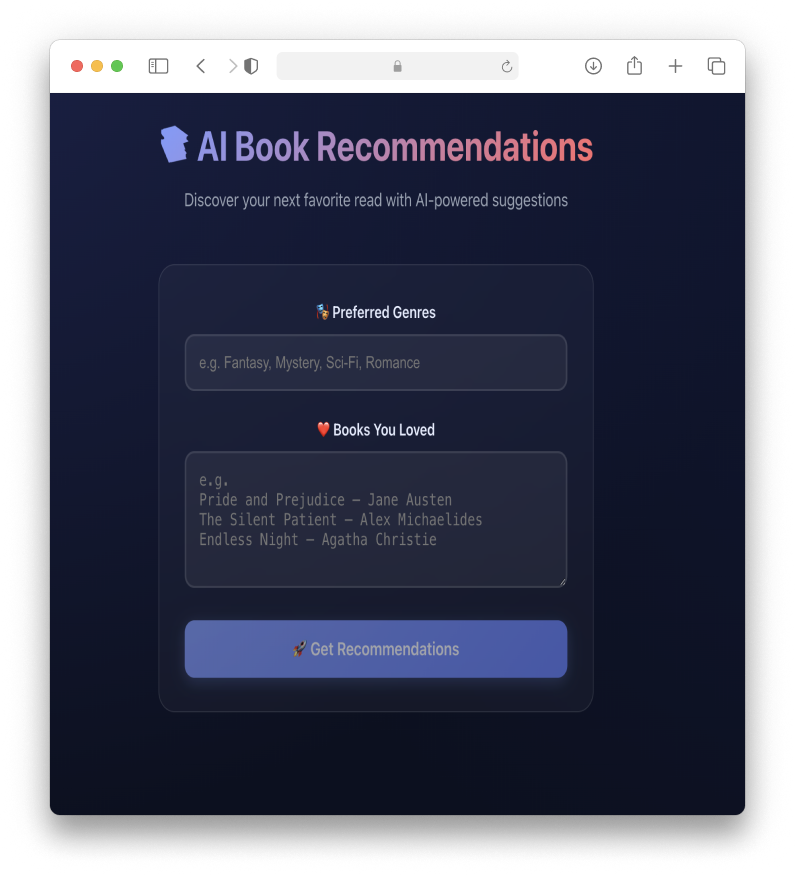

# 📚 AI Book Recommendations
[](https://skillicons.dev) 

Vite + React app with an Express backend that calls Claude AI model to recommend books based on preferred genres and previously liked books.



## Quickstart

1. Create a `.env` file at the project root and set your API key:

```
ANTHROPIC_API_KEY=...
CLAUDE_MODEL=...
PORT=8787
```
    
    Default model is: `claude-3-5-haiku-20241022`.

2. Install dependencies:

```
npm install
```

3. Start the app (runs backend and Vite dev server together):

```
npm run dev
```

4. Open the app at `http://localhost:5173` and try it.
